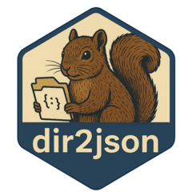

<!-- README.md is generated from README.Rmd. Please edit that file -->

# dir2json 

<!-- badges: start -->
<!-- badges: end -->

The goal of `dir2json` is to provide a utility for converting
directories into JSON format and decoding JSON back into directory
structures. This is particularly useful for archiving, sharing, or
analyzing directory contents in a structured format.

## Installation

You can install the development version of `dir2json` from
[GitHub](https://github.com/) with:

``` r
# install.packages("devtools")
devtools::install_github("parmsam/codebase2json")
```

## Example

This is a basic example which shows you how to encode a directory into
JSON and decode it back:

``` r
library(dir2json)

# Create a temporary directory with a file
example_dir <- tempfile()
dir.create(example_dir)
file.create(file.path(example_dir, "example.txt"))
#> [1] TRUE
writeLines("Hello, dir2json!", file.path(example_dir, "example.txt"))

# Encode the directory to JSON
json_data <- json_encode_dir(example_dir)
cat(json_data)
#> [{"name":"example.txt","content":"Hello, dir2json!\n"}]

# Decode the JSON back to a new directory
new_dir <- tempfile()
json_decode_dir(json_data, new_dir)

# Verify the contents
list.files(new_dir, recursive = TRUE)
#> [1] "example.txt"
readLines(file.path(new_dir, "example.txt"))
#> [1] "Hello, dir2json!"
```
